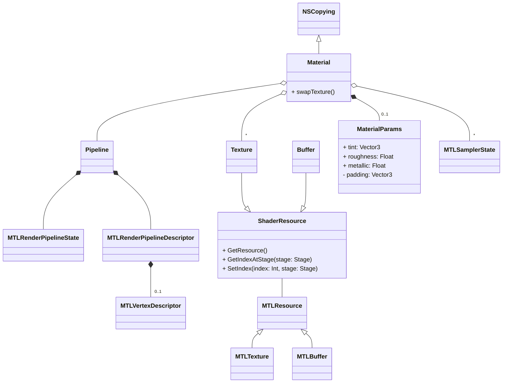

# Material

```mermaid
classDiagram

class Material{
    + swapTexture()
}

NSCopying <|-- Material

Pipeline *-- MTLRenderPipelineState
Pipeline *-- MTLRenderPipelineDescriptor
MTLRenderPipelineDescriptor *-- "0..1" MTLVertexDescriptor

class ShaderResource{
    + GetResource()
    + GetIndexAtStage(stage: Stage)
    + SetIndex(index: Int, stage: Stage)
}

ShaderResource -- MTLResource

Texture --|> ShaderResource
Buffer --|> ShaderResource

class MaterialParams{
    + tint: Vector3
    + roughness: Float
    + metallic: Float
    - padding: Vector3
}

Material o-- Pipeline
Material *-- "0..1" MaterialParams
Material o--"*" Texture
Material o--"*" MTLSamplerState

MTLResource <|-- MTLTexture
MTLResource <|-- MTLBuffer
```