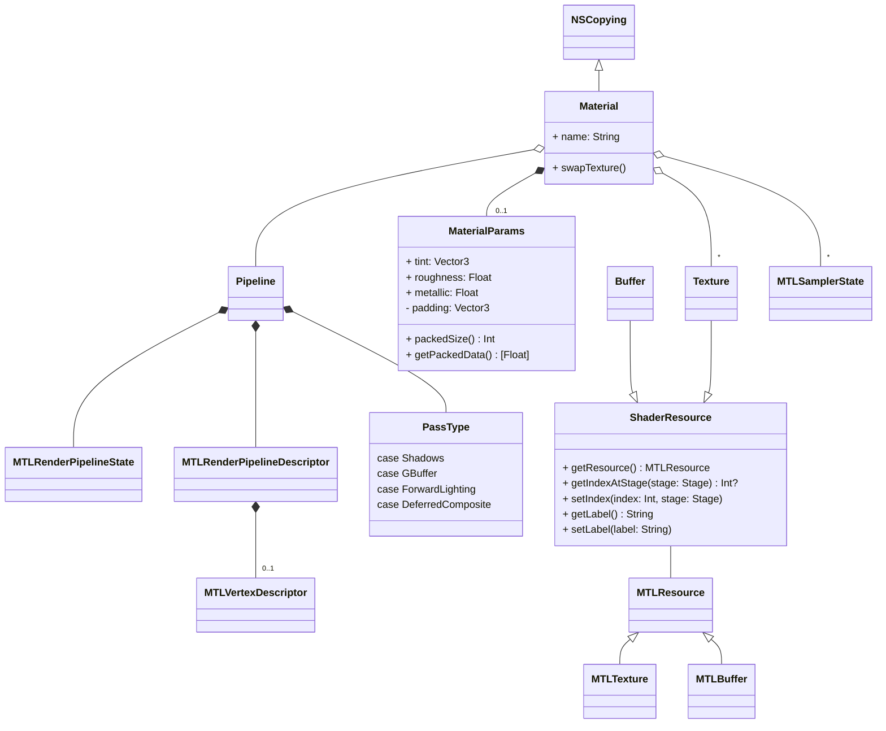

# Material

```mermaid
classDiagram

class Material{
    + name: String
    + swapTexture()
}

NSCopying <|-- Material

Pipeline *-- MTLRenderPipelineState
Pipeline *-- MTLRenderPipelineDescriptor
MTLRenderPipelineDescriptor *-- "0..1" MTLVertexDescriptor

class ShaderResource{
    + getResource() MTLResource
    + getIndexAtStage(stage: Stage) Int?
    + setIndex(index: Int, stage: Stage)
    + getLabel() String
    + setLabel(label: String)
}

ShaderResource -- MTLResource
MTLResource <|-- MTLTexture
MTLResource <|-- MTLBuffer

Texture --|> ShaderResource
Buffer --|> ShaderResource

class MaterialParams{
    + tint: Vector3
    + roughness: Float
    + metallic: Float
    + packedSize() Int
    + getPackedData() [Float]
    - padding: Vector3
}

Material o-- Pipeline
Material *-- "0..1" MaterialParams
Material o--"*" Texture
Material o--"*" MTLSamplerState

Pipeline *-- PassType

class PassType{
    case Shadows
    case GBuffer
    case ForwardLighting
    case DeferredComposite
}
```