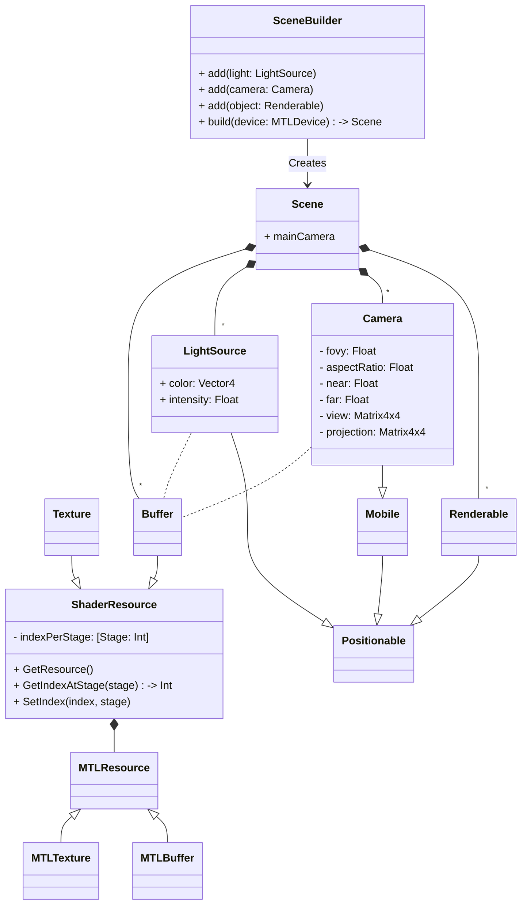

# Scene

⚠️ For now, scenes are static and can only be created through a builder.

## TODO
- [ ] Dynamic scenes
- [ ] Read from file
- [ ] Save to file

```mermaid
classDiagram

class SceneBuilder{
    + add(light: LightSource)
    + add(camera: Camera)
    + add(object: Renderable)
    + build(device: MTLDevice) -> Scene
}
SceneBuilder --> Scene : Creates

Scene: + mainCamera

class Camera{
    - fovy:        Float
    - aspectRatio: Float
    - near:        Float
    - far:         Float

    - view:       Matrix4x4
    - projection: Matrix4x4
}

class ShaderResource{
    + GetResource()
    + GetIndexAtStage(stage) -> Int
    + SetIndex(index, stage)
    - indexPerStage: [Stage: Int]
}
ShaderResource *-- MTLResource

MTLResource <|-- MTLTexture
MTLResource <|-- MTLBuffer

Texture --|> ShaderResource
Buffer --|> ShaderResource

Scene *--"*" Buffer
Scene *--"*" LightSource
Scene *--"*" Camera
Scene *--"*" Renderable

LightSource .. Buffer
Camera .. Buffer

class LightSource{
    + color: Vector4
    + intensity: Float
}

Camera --|> Mobile
Mobile --|> Positionable
LightSource --|> Positionable
Renderable --|> Positionable

```