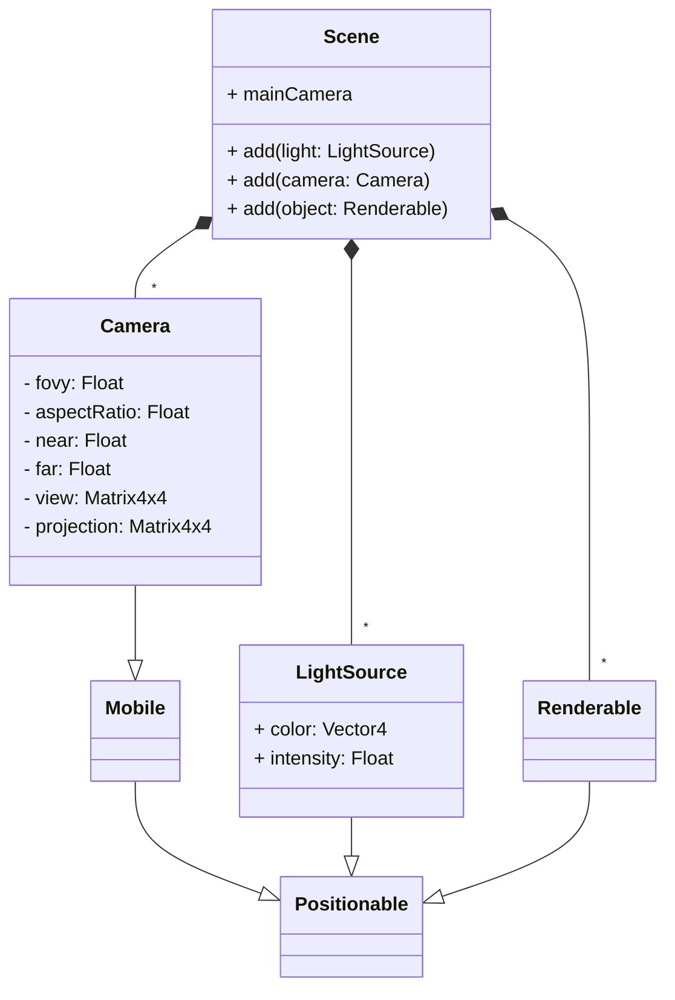

# Scene

⚠️ For now, scenes are static

## TODO
- [ ] Skybox
- [ ] Dynamic scenes
- [ ] Read from file
- [ ] Save to file
- [ ] Create and store the buffers in advance (at the moment scenes are small enough to not need buffers at all)

