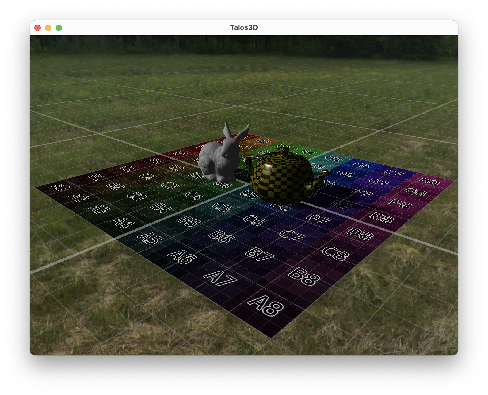

# Talos 3D

A Metal toy engine written on Swift with the intention of learning Metal and implementing different rendering techniques.

## Current state

## Planned "stepping-stone" features
- [x] Importing of .obj files
- [ ] Blinn-Phong lighting model
- [x] FPS camera
- [x] Forward rendering
- [x] Simple shadow maps
- [ ] Skybox

## Planned features
- [ ] Bindless model
- [ ] Importing of .fbx files
- [ ] Simple GUI
- [ ] Physically-Based Rendering
- [ ] Sample Distribution Shadow Maps
- [ ] Deferred rendering
- [ ] SSAO
- [ ] SSR
- [ ] Post-processing effects (bloom, depth of field..)
- [ ] Tile-Based Rendering / iOS version (?)
- [ ] ???
